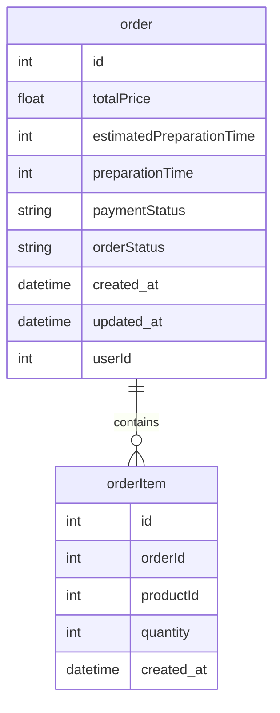

# 🛒 Tech Challenge - Order

## 📌 Sobre o Projeto
O **Tech Challenge - Order** é um microsserviço responsável pela gestão de pedidos dentro do ecossistema do Tech Challenge. Ele permite a criação, consulta e atualização de pedidos, garantindo a rastreabilidade e consistência das operações.

## 🚀 Tecnologias Utilizadas
- **Node.js** + **NestJS** - Framework para aplicações escaláveis
- **TypeScript** - Superset tipado do JavaScript
- **PostgreSQL** - Banco de dados relacional
- **TypeORM** - ORM para gerenciar interações com o banco de dados
- **Docker** - Containerização do microsserviço
- **Jest** - Testes unitários e de integração
- **SQS** - Mensageria para comunicação assíncrona entre microsserviços
- **Swagger** - Documentação da API

## ⚙️ Como Executar o Projeto
### 🔧 Requisitos
Antes de iniciar, certifique-se de ter instalado:
- [Node.js](https://nodejs.org/)
- [Docker](https://www.docker.com/)

### 🏗 Configuração do Ambiente
1. Clone o repositório:
   ```sh
   git clone https://github.com/Grupo-26-FIAP/tech-challenge-order.git
   cd tech-challenge-order
   ```
2. Instale as dependências:
   ```sh
   npm install
   ```
3. Configure as variáveis de ambiente:
   ```sh
   cp .env.example .env
   ```
   Edite o arquivo `.env` conforme suas configurações.

### ▶️ Executando o Projeto
#### Modo de Desenvolvimento
```sh
npm run start:dev
```
#### Executando com Docker
```sh
docker-compose up --build
```
#### Testes
```sh
npm run test:cov
```

## 📖 Documentação da API
A documentação interativa está disponível via **Swagger** após iniciar o projeto:
```
http://localhost:3001/api
```

## 📬 Comunicação Entre Microsserviços
O microsserviço de pedidos se comunica com os demais através do **SQS**, publicando eventos sobre status dos pedidos e consumindo mensagens de outros serviços.

## Documentação do Banco de Dados

Este documento descreve a estrutura do banco de dados utilizado no projeto. Inclui a descrição de cada tabela, suas colunas e os relacionamentos entre elas.

### Diagrama do Banco de Dados

O diagrama abaixo ilustra a estrutura das tabelas e suas relações:



## 👥 Time de Desenvolvimento

| Nome                           | RM           | E-mail                                                             | GitHub                                             |
| ------------------------------ | ------------ | ------------------------------------------------------------------ | -------------------------------------------------- |
| Jhoni Farias                   | **RM357358** | [jhonifarias.developer@gmail.com](jhonifarias.developer@gmail.com) | [@JhoniFarias](https://github.com/JhoniFarias)     |
| Josef Henrique Zambreti        | **RM357836** | [josefhenrique@uol.com.br](josefhenrique@uol.com.br)               | [@Josefhz](https://github.com/Josefhz)             |
| Lucas Rodrigues Medina Costa   | **RM357360** | [lucasmedinarmc@gmail.com](lucasmedinarmc@gmail.com)               | [@diname](https://github.com/diname)               |
| Kleber de Oliveira Andrade     | **RM358012** | [pdjkleber@gmail.com](pdjkleber@gmail.com)                         | [@kleberandrade](https://github.com/kleberandrade) |
| Vitória Camila Xavier Sobrinho | **RM357235** | [vcamilaxs@gmail.com](vcamilaxs@gmail.com)                         | [@itsvickie](https://github.com/itsvickie)         |


## 🛠 Equipe e Contribuição
Este projeto faz parte do **Tech Challenge** da **FIAP**. Contribuições são bem-vindas! Para contribuir:
1. Crie um fork do repositório
2. Crie uma branch (`git checkout -b minha-feature`)
3. Commit suas alterações (`git commit -m 'Adiciona nova funcionalidade'`)
4. Faça um push (`git push origin minha-feature`)
5. Abra um **Pull Request**

---
Desenvolvido com 💙 pelo **Grupo 26 - FIAP** 🚀

